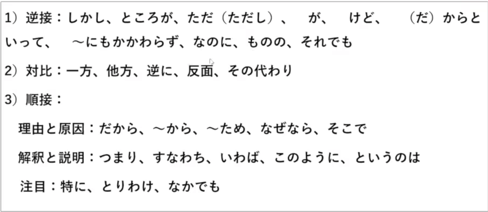

### 
1. ~あげく（に）
接続：た型、名詞＋の
意味：。。。的结果（消极结果）
例文：（重要）
散々迷ったあげく、結局Ｂ大学にした。
考えに考えたあげく、会社を辞めることにした。
さんざん悩んだ・迷ったあげく

2. ～あまり（に）
接続：連体形、名詞＋の、な形容詞＋な
意味：由于过于。。。（前接有感情色彩的词）
例文：（重要）
心配のあまり、眠れなかった。
働きすぎたあまり、とうとう倒れてしまった。

3. ～以上（は）
接続：連体形
意味：既然
例文：（重要）
お金がない以上、あきらめるしかない。
約束した以上は、守らなければならない。
学生である以上、学業を第一に考えるべきだ

4. ～一方・一方で（は）
接続：連体形
意味：一方面……另一方面；一边……一边
例文：
彼女は歌手として活躍する一方で、女優として頭角を現した

5. ～一方だ
接続：辞書形　＋　一方だ
意味：一直，越来越
例文：（重要）
最近家賃が増える一方だ。
どういうわけか、最近私が太る一方だ。

6. ～上で
接続：体言＋の、連体形
意味：在。。。的前提下；在。。。方面上；在。。。之后（た）
例文：（重要）
双方の合意の上で結婚した。
ビザの申請をする上で注意しなければならない。
いろいろ考えた上で、会社をやめることにした。
父と相談した上で、ご返事をします。

7. ～うちに
（1）接続：連体形、名詞＋の
意味：趁着（不用于未来）
例文：（重要）
温かいうちに食べてください。
若いうちにしっかり勉強しなさい。

==（2）接続：動詞ている・ない＋うちに==
意味：在。。。的过程中（发生自然而然的变化）
例文：（重要）
話しているうちに外は暗くなりました。
本を読んでいるうちに、眠くなった。

8. ～ようではないか
接続：意向形
意味：号召劝诱，。。。吧
例文：（重要）
最後まで頑張ってみようじゃないか

9. ～得る
==接続：ます型去ます==
意味：能　可能
そんなこと、ありえないよ。
この問題を解き得た人は一人もいない。
ありうる（あり得る）、ありえない（あり得ない）

10. ～おかげて・おかげだ
接続：連体形、名詞＋の
意味：多亏（积极原因）
例文：（重要）
あの人のおかげて、私たちは幸せに暮らせるのだ。
毎日練習したおかげて、上手になりました。

11. ～恐（おそ）れがある
接続：連体形
意味：恐怕会（消极）
例文：（重要）
このまま森を切り続けば、ここは砂漠になる恐れがある。
台風は5日に沖縄地区に上陸する恐れがある。

### 
1. 召し上がります
2. いらっしゃいます
3. お　＋　（一、二）動詞~~ます~~　＋　になります

### 
1. お　＋　（一、二）動詞~~ます~~　＋　します
2. ご　＋ （三）動詞名詞化　＋　します
3. お目にかかる（会う）
4. 申し上げる（言う）
5. 申します（言う）私は高と申します
6. 参ります（来る）
7. ている　→ ております

###
1. お・ご　＋　動詞~~ます~~　＋　ください

### 

| 动词 | 尊他 | 自谦 |
|------|------|----------|
| ある |  | ございます |
| いる | いらっしゃいます おいでになります | おります |
| 行く | いらっしゃいます おいでになります | 伺います 参ります（まいります） |
| 来る | いらっしゃいます おいでになります お越（こ）になります 見（み）える | 伺います（うかがいます） 参ります |
| する | なさいます | いたします |
| 言う | おっしゃいます | 申（もう）します 申しあげます |
| 見る | ご覧になります | 拝見（はいけん）します |
| 会う | お会（あ）いになります | お目にかかります |
| 知っている | ご存じです | 存じでおります 存（ぞん）じません |
| 思う |  | 存じます |
| 着る | お召しになります |  |
| 食べる | 召（み）し上（あ）がります | いただきます |
| 飲む | 召し上がります | いただきます |
| 寝る | お休（やす）みなります |  |
| 死る | お亡（ま）くなりになります |  |
| あげる |  | さしあげます |
| くれる | くださいます |  |
| もらう |  | いただきます |